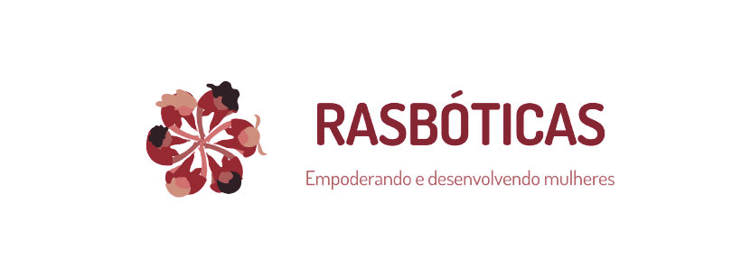

<!-- adicionar os badges  -->

## Descrição

O projeto RASbóticas tem como objetivo encorajar a participação e desenvolvimento de habilidades relacionadas a robótica e automação de mulheres, a fim de incentivar a atuação feminina em áreas predominantemente masculinas.

Para alcançar estes objetivos, é fundamental ter referências femininas a frente, para que haja representatividade. Assim, o projeto foi fundado em 2020 e atualmente é orientado por alunas do curso de Engenharia Elétrica, que possuem experiências na área, adquiridos por meio da participação no Capítulo Estudantil IEEE RAS UFCG. Dessa forma, as alunas se inspiram em mulheres próximas a elas formando um vínculo de empoderamento e força.

### Palavras-chaves
Robótica, Mulheres, Empoderamento, Tecnologia

## Metodologia

O projeto abre turmas em até duas vezes ao ano, desde 2020. Apesar de ser uma iniciativa de alunas do curso de Engenharia Elétrica, é aberto a alunas de todos os cursos, aos quais os encontros são realizados de maneira semanal e online, para que seja o mais acessível possível. Nesses encontros, são apresentadas as partes teória e prática dos conteúdos considerados importantes a quem quer ingressar na área. Além disso, como o intuito é sempre de incentivar o engajamento feminino, há um momento de inspiração ao qual as alunas trazem o relato de uma mulher inspiradora nas áreas de ciência e tecnologia. Para o encerramento da turma, as alunas desenvolvem um projeto que envolve programação em Python, com o objetivo de aplicar os conhecimentos desenvolvidos. É uma troca incrível de alunas de cursos diferentes, lugares diferentes mas com o mesmo interesse em robótica e tecnologia.

## Tecnologias

Ao longo do projeto as alunas utilizam as seguintes tecnologias:

- [Colab](https://colab.research.google.com/)
- [Tinkercad](https://www.tinkercad.com/)
- [CoppeliaSim](https://www.coppeliarobotics.com/)

## Conteúdos Apresentados
- Introdução a Eletrônica
- Tinkercad
- Intrdodução a Programação 
- Sensores
- Atuadores
- Git/Github
- Introdução a Python

<h4 align="center"> 
	🚧  Readme em construção...  🚧
</h4>
